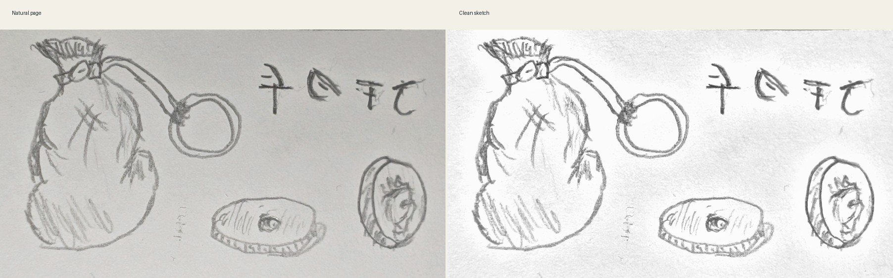
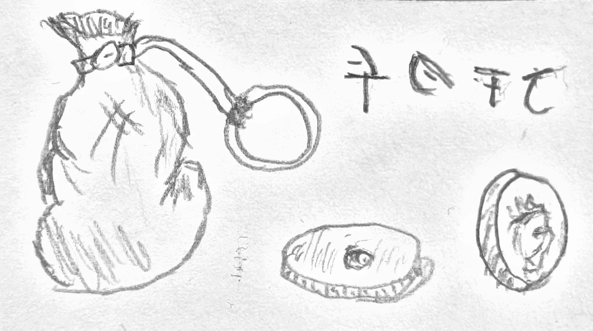
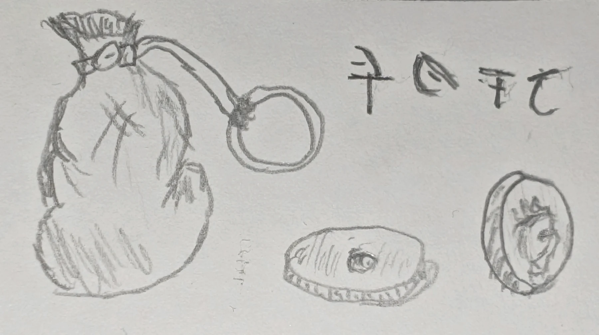
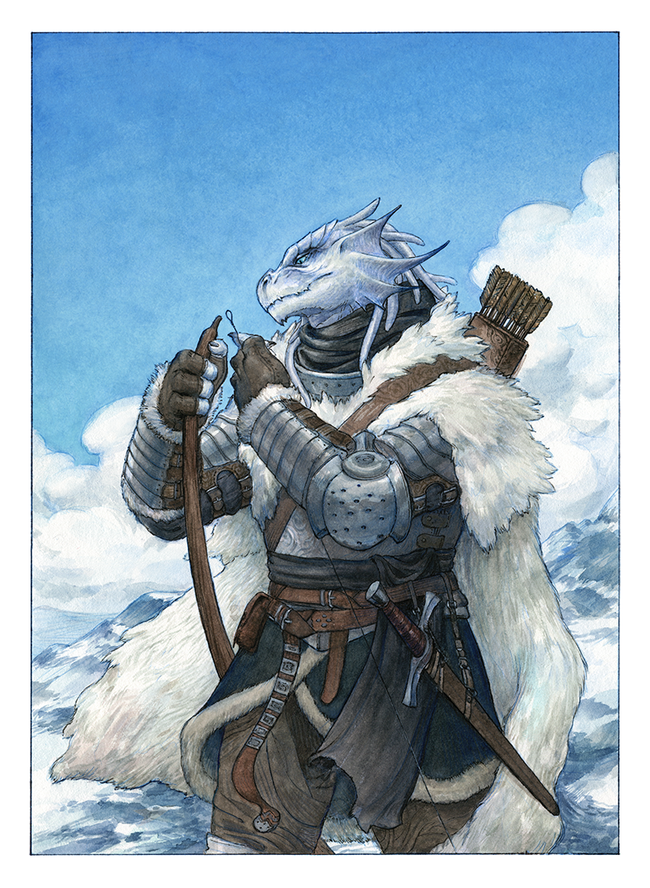

I was born in a small, nameless village on an icy plain. It was cold. Always cold. The wind never really died down, and the sun never quite seemed to break through the gray air.

There was always something that needed doing if we wanted to survive. Gather what little wood we could find, chase small animals, repair things, and my favorite, fish wherever we could get down to the water. I went about my work quietly. Life was peaceful enough, but that gave me plenty of time to wonder about everything beyond the plains. I wondered if the rest of the world really was as dull and isolated as my little corner of it.

I don't remember exactly when I decided I couldn't take it anymore. There wasn't a fight or some great disaster. I just decided to leave. I said goodbye to my parents and took what I could carry. I'm still not sure what they thought about the whole thing. About my adventure.

 "A comparison."

Well, it turns out the world isn't as warm as I expected.

The snow thins the farther south you walk. Underneath it there are colors everywhere. I had never seen so much green. The villages are stranger still. Some are hardly more than a few tents. Others have walls, streets, and permanent buildings large enough that I think my entire village could fit inside one.

Surviving out here is easier in some ways. There is far more prey, and plants seem to grow almost everywhere. Food is also more troublesome than I expected. Meat goes rancid incredibly quickly when you don't have the cold to keep it. I learned that lesson more than once. Better to throw spoiled meat to the wolves than fight them over something I shouldn't eat anyway.

Forests were strange at first. So many trees packed together that you can't see the horizon. I was surprised to learn that many people avoid them. I rather like them now. They're quiet. When I want company I can return to the roads and towns, and when I don't, the woods give me plenty of room.

Eventually I learned that people will pay someone who knows how to move through the wilderness. Guiding travelers, hunting, finding trails, keeping watch. It all came naturally enough. Money was the part I had to learn.

It turns out money is useful.

I was practically wearing strips of hide and fur until I met merchants willing to pay me for helping them. Now I can buy the things I was never very good at making myself, especially clothes. I've also learned that stalls in town tend to be considerably less hostile when you hand over coins before taking anything.

That was an early lesson.

